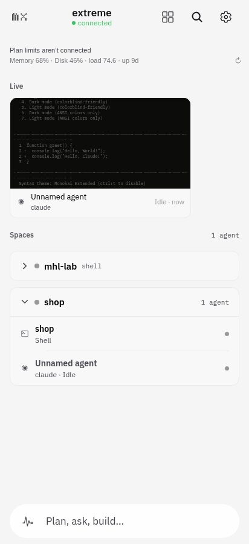
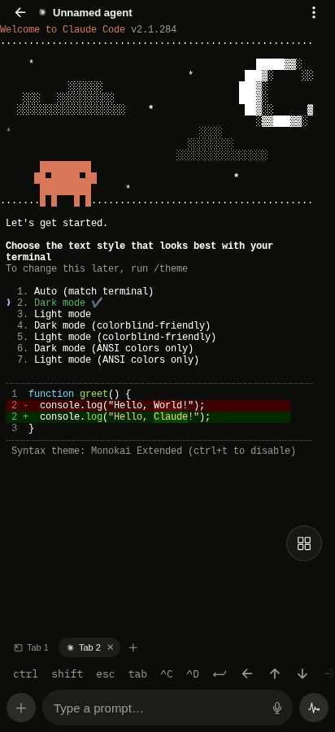
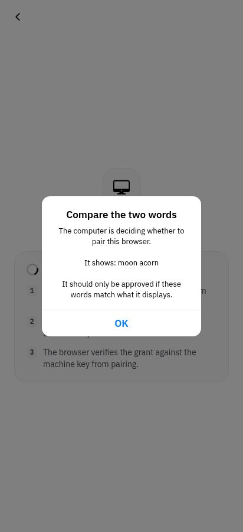

<h1 align="center">
  <a href="https://trymuxr.com"></a> muxr for Herdr
</h1>

<p align="center">
  <a href="https://herdr.dev/plugins/"></a>
  <a href="https://www.npmjs.com/package/@trymuxr/cli"></a>
  <a href="https://github.com/umeranjum17/muxr-herdr/actions/workflows/ci.yml"></a>
  <a href="LICENSE"></a>
</p>

<p align="center">
  <strong>Every agent. The real terminal. In your pocket.</strong><br/>
  This plugin installs <a href="https://github.com/umeranjum17/muxr">muxr</a> from inside Herdr. One command gets you setup, pairing and service control as Herdr actions and panes; your phone then sees every agent Herdr runs, opens its exact live terminal, and prompts it like you're at the desk.
</p>

<p align="center">
  <picture><source srcset="docs/assets/pwa-home.webp" type="image/webp"></picture>
  <picture><source srcset="docs/assets/pwa-agent.webp" type="image/webp"></picture>
</p>

## Install

You need [Herdr](https://herdr.dev) 0.9.1 or newer and [Node.js 22 or newer](https://nodejs.org/) on Linux or macOS.

```bash
herdr plugin install umeranjum17/muxr-herdr --ref v0.3.0
herdr plugin pane open --plugin muxr.control --entrypoint setup
```

Always install a release tag. Each tag is one muxr release: the install downloads `@trymuxr/cli` at exactly that version, checks it against the sha256 pinned in [build.mjs](build.mjs), and installs it into the plugin folder with install scripts turned off. Nothing is built from source, and a branch or bare commit is refused.

The setup pane walks you through the rest: pick how your phone reaches this computer, start the muxr service, and pair. It changes nothing until you choose **Apply setup**.

## Pair your phone

Setup ends by pairing a device. Scan the one-use QR with the muxr app, or open the one-time link in a browser, then check that both screens show the same two words before you approve.

<p align="center">
  <picture><source srcset="docs/assets/pwa-pair.webp" type="image/webp"></picture>
</p>

```text
“Browser” wants to pair with this computer.

  Compare these words on the phone:  moon acorn

Only approve if the words match. Approve this device? (y/N) y
  ✓ paired and verified Browser

  ok    muxr versions      CLI 0.3.0 · host 0.3.0 · Herdr plugin 0.3.0 (umeranjum17/muxr-herdr@v0.3.0)
```

Get the app from [trymuxr.com/downloads](https://trymuxr.com/downloads) (Android APK, Google Play testing, iOS TestFlight), or pair a browser for eight hours. Pair more devices later from the **Pair muxr** pane.

## What you get in Herdr

| | |
|---|---|
| **Panes** | setup, pair, devices, doctor, service, self-host relay, logs, uninstall, screen-sharing approval |
| **Actions** | start, stop, restart, status, sync agent integrations, update, put `muxr` on PATH, split right, split down |

Run an action with `herdr plugin action invoke <action> --plugin muxr.control`, or open a pane with `herdr plugin pane open --plugin muxr.control --entrypoint <pane>`. The **Put muxr on PATH** action links `muxr` into `~/.local/bin`, so your shell and your agents can run `muxr name` and `muxr share`.

## How it works

The plugin is a launcher. Each action and pane runs one bounded `muxr` command and exits. The relay and host run under your user service manager (`muxr.service` on Linux, launchd on macOS) through `muxr up`, so they keep serving your phone while Herdr restarts and after you log in again.

Herdr runs plugin commands with its server's environment, not your shell's, so the plugin finds your muxr home from the installed service definition. `muxr doctor` shows whether the plugin, the CLI and the running host are the same release.

## Update and uninstall

- **Update:** run the **Update muxr** action. It reinstalls this plugin at the new release tag, which brings the matching CLI with it, and restarts the service. If the service does not come back, it rolls back to the previous tag.
- **Uninstall** has three layers, in this order:
  1. The **Uninstall muxr** pane runs `muxr uninstall`, which removes the service, ingress, pairings and state. It asks before removing anything.
  2. `herdr plugin uninstall muxr.control` removes the plugin. The pane offers to do this for you.
  3. Herdr keeps each plugin's config and state folders. Remove them yourself if you want them gone; `herdr plugin config-dir muxr.control` prints where the config lives.

## Already use muxr from npm?

Both install the same plugin id, `muxr.control`, and a machine has one of them. Setup from npm links Herdr to the copy inside the npm package. Herdr refuses to install over a linked copy, so to switch, unlink it first:

```bash
herdr plugin unlink muxr.control
herdr plugin install umeranjum17/muxr-herdr --ref v0.3.0
```

The npm install ([`@trymuxr/cli`](https://www.npmjs.com/package/@trymuxr/cli)) stays the way to run muxr without Herdr's plugin system, on a VPS relay, or in Docker. See the [muxr README](https://github.com/umeranjum17/muxr#install).

## Releasing

A muxr release that should reach Herdr needs a matching tag here:

1. Set `version` in [herdr-plugin.toml](herdr-plugin.toml) to the published `@trymuxr/cli` version, and copy any changed actions and panes from muxr's `resources/control/herdr-plugin.toml`, pointing them at `./node_modules/@trymuxr/cli/resources/control/run.mjs`.
2. Set `CLI_SHA256` in [build.mjs](build.mjs) to the sha256 of that version's npm tarball: `npm pack @trymuxr/cli@X.Y.Z && sha256sum trymuxr-cli-X.Y.Z.tgz`.
3. Merge, then tag the merge commit `vX.Y.Z`. The **Update muxr** action installs the tag named after the npm version, so every published version needs its tag.

`node --test build.test.mjs` checks the build without a network or a real release. To try an unreleased CLI in a lab, point the build at a locally packed tarball, which is still checked against a sha256 you supply:

```bash
MUXR_PLUGIN_CLI_TARBALL=/path/trymuxr-cli-X.Y.Z.tgz MUXR_PLUGIN_CLI_SHA256=<sha256> \
  herdr plugin install umeranjum17/muxr-herdr --ref vX.Y.Z
```

## License

Apache License 2.0, like muxr itself. See [LICENSE](LICENSE). The muxr name and marks are covered by muxr's [TRADEMARK.md](https://github.com/umeranjum17/muxr/blob/main/TRADEMARK.md).
